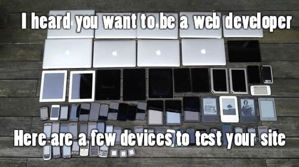

## 固定比例容器

| 类 | 描述 |
|---|---|
| .ratio | 固定比例媒体容器 |
| .ratio-21x9 | 21:9容器 |
| .ratio-16x9 | 16:9容器 |
| .ratio-4x3 | 4:3容器 |
| .ratio-1x1 | 1:1容器 |
| .ratio-item | 媒体内容 |

```html
<div class="row row-gx-4 row-gy-4">
    <div class="col-md-2 col-sm-4 col-xs-6 col-gx-4 col-gy-4">
        <div class="ratio ratio-1x1">
            
        </div>
    </div>
    <div class="col-md-2 col-sm-4 col-xs-6 col-gx-4 col-gy-4">
        <div class="ratio ratio-1x1">
            
        </div>
    </div>
    <div class="col-md-2 col-sm-4 col-xs-6 col-gx-4 col-gy-4">
        <div class="ratio ratio-1x1">
            
        </div>
    </div>
    <div class="col-md-2 col-sm-4 col-xs-6 col-gx-4 col-gy-4">
        <div class="ratio ratio-1x1">
            
        </div>
    </div>
    <div class="col-md-2 col-sm-4 col-xs-6 col-gx-4 col-gy-4">
        <div class="ratio ratio-1x1">
            
        </div>
    </div>
    <div class="col-md-2 col-sm-4 col-xs-6 col-gx-4 col-gy-4">
        <div class="ratio ratio-1x1">
            
        </div>
    </div>
</div>
```
